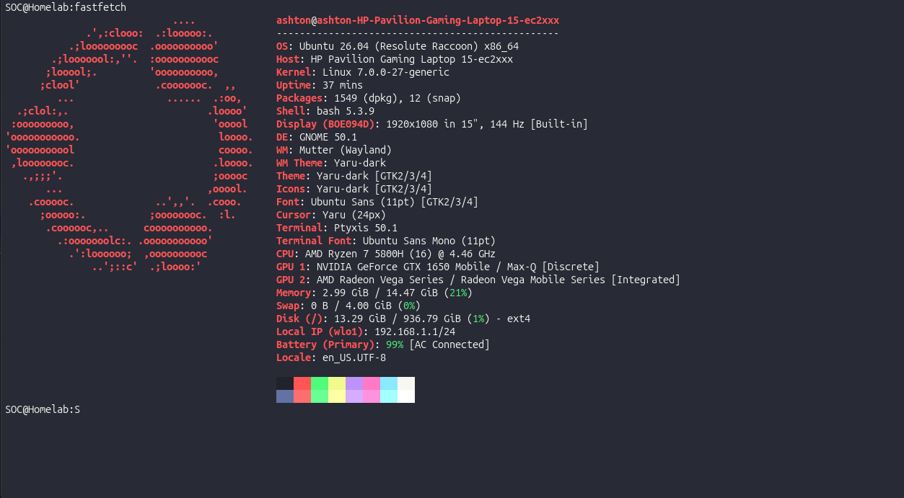
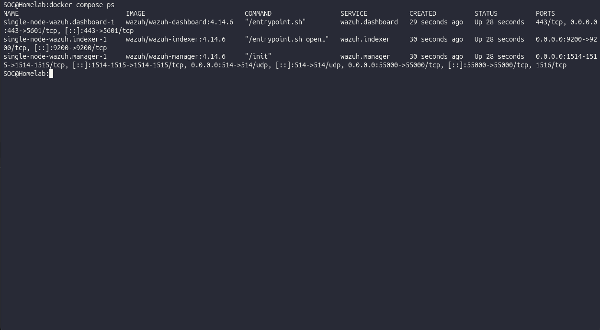
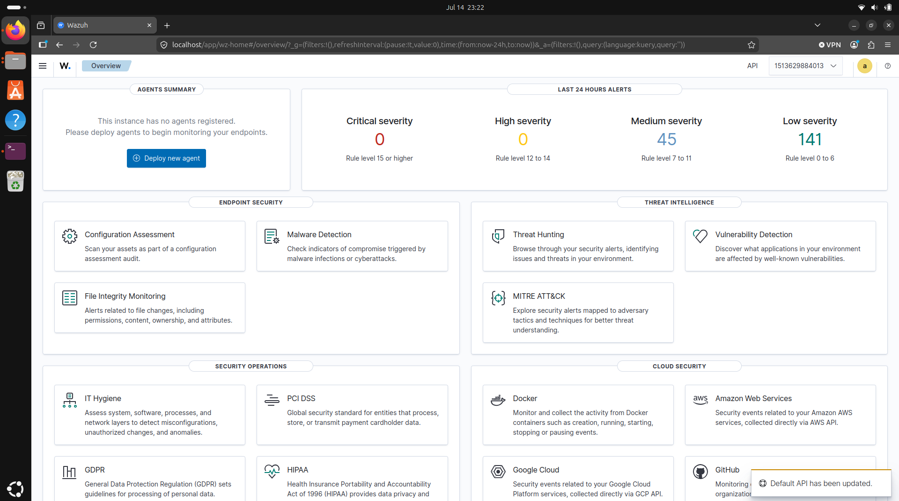

# I wiped my laptop to build a SOC in my bedroom

*Every SOC analyst job post wants hands-on SIEM experience. I didn't have a SIEM, so I wiped an old laptop and built one with Wazuh in Docker, including the vm.max_map_count setting that cost me half an hour.*

I kept reading job posts for SOC analyst roles that all wanted the same thing: hands-on experience with a SIEM. A SIEM is the system a security team stares at all day. It collects logs from every machine, reads them, and raises alerts when something looks like an attack. I understood what one was. I'd never actually run one. You can't get hands-on with a tool you don't have, so I decided to build the whole thing myself on a laptop I already owned.

This is the story of getting it standing up. No attacks yet, that's the next posts. This is just the part where an empty laptop becomes a working security monitoring system, and the one mistake that cost me half an hour on the way.

## The decision to wipe

The laptop is a Ryzen 7 5800H with 16 GB of RAM. Plenty for this. The question was Windows or Linux, and I went all in: wiped Windows completely and put Ubuntu on it. I could have dual-booted and kept both, but I wanted the lab to be the only thing the machine does. A dedicated box I'm not scared to break.



Backing up first was non-negotiable, a wipe is permanent, but once my files were safe it was a clean install of Ubuntu 26.04 and no looking back.

## Wazuh in three containers

The SIEM I picked is Wazuh: open source, free, and it runs on hardware I actually have. It comes as three pieces:

- **The indexer** stores and searches all the data.
- **The manager** reads events and holds the detection rules.
- **The dashboard** is the web page I look at.

I ran them in Docker, which packages each piece into its own self-contained container so I'm not hand-installing three services and praying they get along. There's a multi-node version for big deployments, but 16 GB won't run a cluster, so I ran one of each, the single-node setup, and pointed it at the host itself as its first monitored machine.



The whole stack idles around 7 GB, which leaves me room to attack it later.

## The half hour I'm not getting back

The indexer wouldn't stay up. It would start, die, restart, die again, in a loop. I sat there watching containers flap and assuming I'd pulled a broken image or misconfigured Docker.

I hadn't. Buried in the logs was this:

```
max virtual memory areas vm.max_map_count [65530] is too low, increase to at least [262144]
```

The indexer needs a lot of memory-mapped areas (I still only half understand what those are), and Linux ships with the limit set too low for it. One line fixed it:

```
sudo sysctl -w vm.max_map_count=262144
```

The lesson wasn't the command. It was where I'd been looking. I'd spent thirty minutes reading container logs hunting for a container problem, and the problem was a setting on the host underneath the containers. The SIEM was fine. The ground it was standing on wasn't. I've since learned that's the single most common Wazuh-on-Docker gotcha, which made me feel slightly better about the half hour.

## It comes alive

After that it just worked. I opened `https://localhost`, clicked past the self-signed certificate warning (the lab makes its own cert, so the browser doesn't trust it, which is fine), logged in, and there it was. A real dashboard, waiting for data.



Empty, at that point. It was watching nothing. But it was mine, running on a laptop in my room, and every alert I've caught since has come through that screen.

## What I took away

The thing I didn't expect to learn from a setup post is that a SIEM isn't one program you install. It's a few services that each have their own needs, sitting on a host that has its own needs too, and getting them to agree is half the work. Before this, "set up a SIEM" was one line on a to-do list. Now I know it's an indexer that's fussy about kernel settings, a manager that holds the rules, a dashboard behind a cert you have to accept, and a host underneath all of it that can quietly break the whole thing with one number set too low.

Next post: putting the first agent on and finally giving it something to watch.

## Limits

It's one laptop, so it's a single point of everything: if the machine is off, nothing is monitored. There's no network capture yet, just logs from the host. For learning, that's exactly enough. It's not a real SOC and I'm not pretending it is, it's the smallest honest version of one, and it runs.
