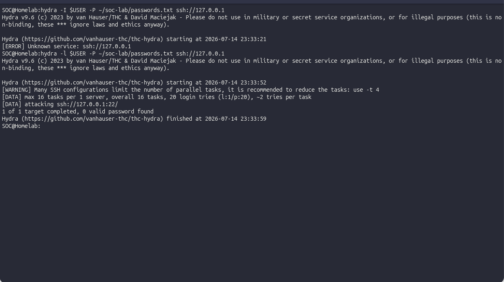
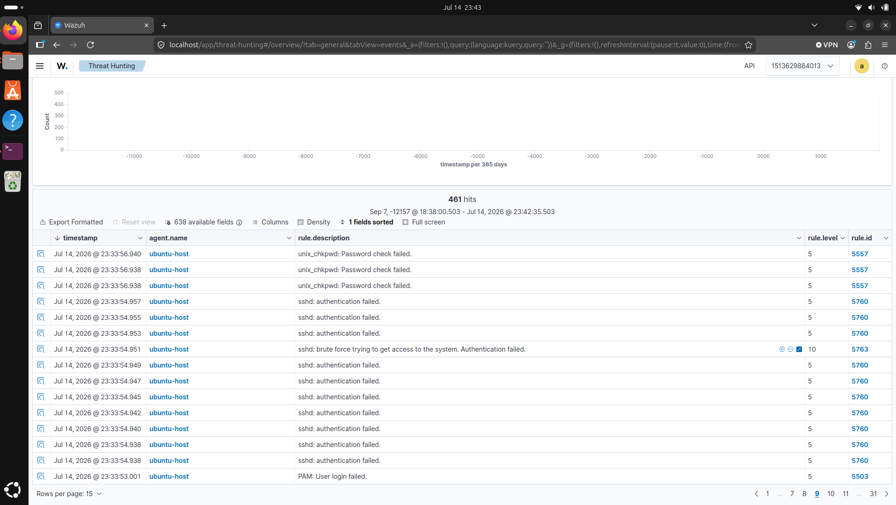
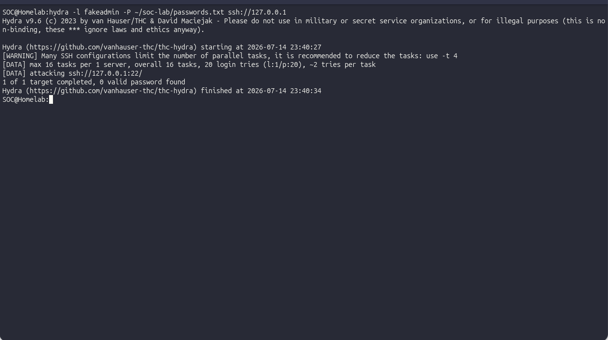
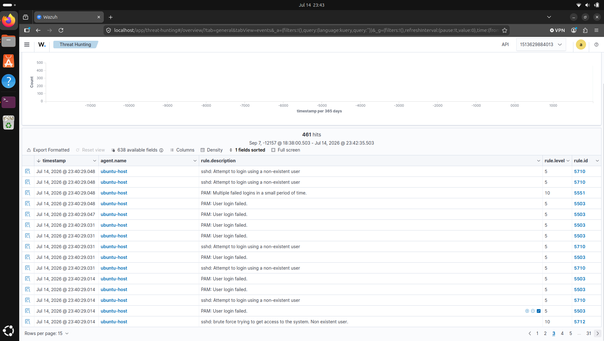

# The two ways Wazuh sees a brute-force

I wanted my first real detection to be the most obvious attack there is: someone guessing passwords at an SSH login over and over. I already had Wazuh running on my laptop and watching itself, so all I needed was to play the attacker for a minute. What I didn't expect was to learn that "a brute-force" isn't one thing to Wazuh. It's two, and which one it reports depends on a detail I hadn't thought about.

## The attack

I installed `hydra`, a tool that throws passwords at a login as fast as it can, and pointed it at my own machine. First I made a throwaway list of twenty wrong passwords, then ran it against my own username:

```bash
hydra -l $USER -P ~/soc-lab/passwords.txt ssh://127.0.0.1
```

My first attempt at this actually errored out. I'd typed `-I` (capital) instead of `-l`, and hydra just replied `[ERROR] Unknown service: ssh://127.0.0.1` and quit. Small thing, but it's the kind of typo that makes you doubt the whole setup for a second before you notice one character is wrong.

The corrected run did what it was supposed to: twenty failed logins in about seven seconds. A single failed login is nothing, everyone fat-fingers a password. Twenty in seven seconds is a script.



## What fired

Wazuh caught it as rule 5763, "sshd: brute force trying to get access to the system." Level 10, mapped to MITRE T1110, Brute Force.



But I'd read that the SSH brute-force rule was 5712, and I wasn't getting 5712. I got 5763. For a minute I thought I'd done something wrong.

## The part I got wrong

I hadn't done anything wrong. I'd just misunderstood what the rules were counting.

Wazuh doesn't have one brute-force rule, it has two paths, and the fork is whether the username you're guessing exists. Hammer a username that doesn't exist on the box and you go down one path, ending in 5712. Hammer a real username with wrong passwords and you go down the other, ending in 5763 by way of 5720.

I'd run `hydra -l $USER`, my own, real username. So of course Wazuh filed it as "a real account getting failed passwords," not "someone poking at accounts that aren't there." To see 5712, I re-ran it with a made-up name:

```bash
hydra -l fakeadmin -P ~/soc-lab/passwords.txt ssh://127.0.0.1
```

`fakeadmin` doesn't exist, and 5712 fired.





The rule chain underneath makes the fork explicit:

| Rule | Fires when |
|---|---|
| 5710 | A login attempt used a username that doesn't exist (informational) |
| 5712 | Repeated attempts against non-existent usernames escalate to brute force |
| 5720 | Repeated auth failures for a valid user |
| 5763 | That valid-user failure pattern escalates to brute force |

## Proving the logic

The alert in the dashboard is nice, but I wanted to see why it fired, not just that it did. Wazuh ships a tool called `wazuh-logtest` that takes a raw log line and shows you the exact decoder and rule that catch it:

```bash
docker exec -it single-node-wazuh.manager-1 /var/ossec/bin/wazuh-logtest
```

I pasted in a raw failed-login line and it printed the decoder that pulled the fields out and the rule that matched, before I'd generated a single real event. That was the moment it stopped feeling like magic. I could watch a plain line of text turn into a classified alert.

## What I took away

Two attacks that look identical to me, twenty wrong passwords, look like two different events to Wazuh, purely because of whether the username was real. That distinction is the whole point. An attacker spraying a login usually guesses common usernames (`admin`, `root`) that may or may not exist, and Wazuh is quietly sorting "guessing at accounts that aren't there" from "guessing at an account that is." I'd have missed that entirely if my first attack had happened to use a fake name and just worked.

## Limits

This catches a noisy brute-force: twenty tries in seconds. It wouldn't blink at a patient attacker trying three passwords an hour for a week, since that stays under the frequency threshold. That slow version is a real gap, and it's the next thing I want to understand.

## Ethics

Every attack here ran against `127.0.0.1`, my own lab host. I'd never point hydra at a machine I don't own and have explicit permission to test.
