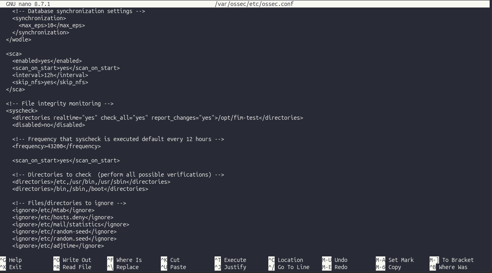
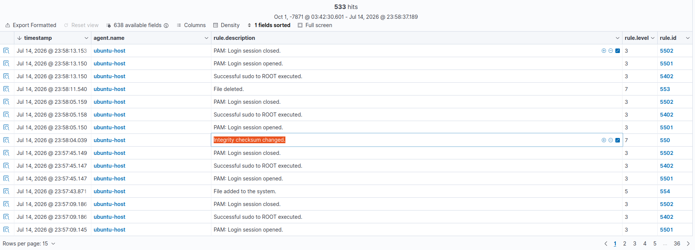

# Detection without an attacker: watching files change

*Setting up File Integrity Monitoring in Wazuh and learning that half of detection has nothing to do with recognizing an attacker. It's just knowing what normal looks like well enough to notice when it stops.*

My first detection was a brute-force: a loud, obvious attack with a tool firing passwords at a login. This one is the opposite. There's no attacker, no exploit, nothing dramatic. A file just changes, and Wazuh notices. That turned out to be a more useful thing to understand than the flashy attack.

## What FIM actually is

FIM stands for File Integrity Monitoring. Plain version: you hand Wazuh a folder and say "tell me the instant anything in here is created, edited, or deleted." That's it. It's how you'd catch someone tampering with a config file, or malware dropping itself somewhere it shouldn't be, not by recognizing the attacker, but by noticing the change they leave behind.

## Setting it up

I made a throwaway folder for the agent to watch:

```
sudo mkdir -p /opt/fim-test
```

Then I added one line to the agent's config (`/var/ossec/etc/ossec.conf`), inside the `<syscheck>` section (syscheck is Wazuh's internal name for FIM):

```
<directories realtime="yes" check_all="yes" report_changes="yes">/opt/fim-test</directories>
```



The three settings each earn their place. `realtime="yes"` means it alerts the moment something happens instead of on a slow schedule. `report_changes="yes"` is the one I'm glad I turned on: it doesn't just say a file changed, it shows what changed. Then I restarted the agent so it read the new setting.

## Poking the folder

Three commands, three kinds of change:

```
echo "original secret" | sudo tee /opt/fim-test/secret.txt      # created
echo "tampered!"       | sudo tee -a /opt/fim-test/secret.txt   # modified
sudo rm /opt/fim-test/secret.txt                                # deleted
```

## What fired

Three alerts, one per change: 554 for the file being added, 550 for the modification, 553 for the deletion.



The modified alert was the one that made me sit up. Because I'd turned on `report_changes`, rule 550 didn't just tell me `secret.txt` changed, it showed me the actual line that got added. The raw alert carries a `diff` field: `1a2\n> tampered!\n`. Wazuh had hashed the file before and after (MD5, SHA1, SHA256, all three) and handed me the exact edit, down to the byte count going from 16 to 26.

## The part that clicked

I'd been thinking about detection as "spot the attacker": recognize the hydra, recognize the exploit. FIM doesn't do that. It never looks at who or how. It watches state and reports change. And a lot of the worst things an attacker does are quiet edits: a new line in `authorized_keys`, a changed cron job, a modified binary. There's no loud attack to catch, only a file that isn't what it was a minute ago.

So the lesson wasn't a rule number. It was that half of detection is just knowing what normal looks like precisely enough to notice when it stops being normal.

## Limits

FIM tells you something changed. It doesn't tell you if the change was legitimate. If I edit that file myself, I get the exact same alert as an attacker editing it. On a real system you'd tune it heavily: watch the paths that matter, ignore the ones that change constantly, or you'd drown in alerts about your own noise. For a lab of one folder, that's fine. On a real host it'd be the whole challenge.
