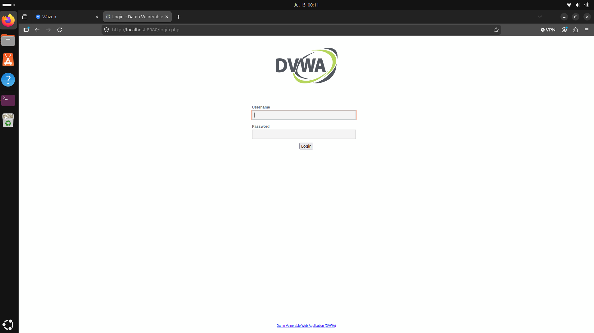

# Attempt, 200, or actually owned: three things a web alert doesn't tell you apart

*Throwing SQLi, XSS, and path traversal at DVWA and watching every single one collapse into the same Wazuh alert, and what that taught me about what a log-based SIEM can and can't actually see.*

For the third detection I wanted something that looked like real SOC work: watching web traffic for injection attempts. So I stood up DVWA, a web app that's deliberately full of holes, threw the classic attacks at it, and had Wazuh read the web server's log. The attacks themselves took five minutes with curl. What I actually learned was that "attack detected" is three different claims wearing the same alert.

## The setup

DVWA runs in a Docker container. The trick isn't attacking it, it's getting its logs to Wazuh. My agent runs on the host, but the web server's log lives inside the container, so I had to bridge the two:

```
docker run -d --name dvwa -p 8080:80 -v /opt/dvwa-logs:/var/log/apache2 vulnerables/web-dvwa
```

The `-v` part mounts the container's Apache log folder onto a folder on my host, so the agent can read it. Then I pointed the agent at that file by adding a block to its config:

```
<localfile>
  <log_format>apache</log_format>
  <location>/opt/dvwa-logs/access.log</location>
</localfile>
```



## The part that cost me time

`access.log` didn't exist. I kept checking `/opt/dvwa-logs/` and it was empty, and for a while I thought Apache wasn't even running. It was: the problem was that mounting an empty host folder over the container's log directory meant the log had nowhere to appear until the container was recreated cleanly and actually served a request. Once I rebuilt it, logged in, and hit a page, the file showed up.

The lesson there had nothing to do with security. It was that my detection was only as good as the plumbing underneath it, and I'd spent twenty minutes debugging Wazuh when the problem was a Docker mount. The SIEM was fine. The pipe into it wasn't.

## The attacks

Three classics against three DVWA modules, once I had a logged-in session cookie:

```
# SQL injection (UNION-based)
curl "http://localhost:8080/vulnerabilities/sqli/?id=1'+UNION+SELECT+user,password+FROM+users--+-&Submit=Submit"

# Reflected XSS
curl "http://localhost:8080/vulnerabilities/xss_r/?name=<script>alert(1)</script>"

# Local file inclusion / path traversal
curl "http://localhost:8080/vulnerabilities/fi/?page=../../../../etc/passwd"
```

Each one left its fingerprint in the access log: `UNION+SELECT` for the injection, the `<script>` tag for the XSS, `../../../../etc/passwd` for the traversal. That's exactly what Wazuh matches on.

## What fired, and the thing that confused me

I expected a tidy set: separate rules for the SQL injection and the XSS. Instead every single attack came back as 31106. At first I thought I'd broken something.

I hadn't. 31106 is "a web attack returned code 200 (success)." It's a rule built on top of the specific attack-pattern rules (31103 for SQLi, 31105 for XSS, and so on), it only fires because one of those already matched, and then it notices the server answered `200 OK`. Earlier, before I had a working session cookie, the requests were bouncing to the login page, so no 200, so no 31106. Once the cookie worked, DVWA served every malicious request, so every attack escalated to 31106.


All three carry MITRE T1190, Exploit Public-Facing Application, at level 6.

## The part that clicked

Here's the thing that took me a second to accept: a 200 does not mean the attack worked. Wazuh is reading a text log. It sees the request and it sees the response code. That's all it has. It knows the SQL injection was sent and that the server returned a normal page. It has no idea whether the injection actually dumped a table.

So one alert quietly hides three different claims. There's the attempt, a malicious pattern in the request (31103 or 31105 underneath). There's served a 200, meaning the server processed it without erroring (31106). And there's actually compromised, meaning the attack achieved something, which Wazuh cannot see at all from a log.

A 200 is a stronger signal than a 404, and worth escalating. But it's an inference, not proof. If I were triaging this for real, "31106" would move me to go look, check the app, the database, the response body, not to declare a breach.

## What I took away

I came in thinking the job was "get the alert to fire." The real skill is reading what the alert can and can't know. A log-based SIEM sees requests and status codes, not consequences. The distance between "an attack was attempted" and "an attacker got in" is exactly the distance a SOC analyst has to close by hand.

## Limits

This detection is pure pattern-matching on a log. It catches attacks that look like attacks in the URL, and it would miss an injection cleverly encoded to dodge the signatures. It could also false-positive on a legitimate request that happens to contain a word like `select` or `../`. As covered, it can flag a 200 but never confirm a real compromise. For learning how web attacks show up in logs, that's plenty. For trusting it in production, every one of those gaps is a project of its own.

## Ethics

DVWA ran locally against `localhost:8080`, a container on my own machine. I'd never run these payloads against an app I don't own or have permission to test.
